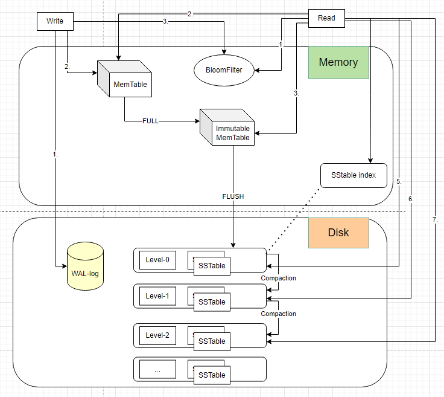

## LSM Tree Flow Chart


## 進度
- [x] LSM Tree similar sql and store the data on the file and push to S3
  - [x] MemTable (Red black tree)
  ```text
  值先寫入Wal log裡面記錄同時記錄到硬盤然後到一定數量一次給memTable
  ```
  - [x] IMemTable
  - [x] Open
  - [x] Wal
    - [x] Write the log 
  - [x] SStable

```text
open->lsm->walManager-> write log if log count > maxCount -> memtable
if memtable size > maxSize -> imemtable
if imemtable size > maxSize -> ssTable
ssTable -> write file -> LSM Tree
```
  
- [x] Use Kubernetes to deploy the environment 
  - EKS cluster
  
- [x] Use Docker to build the image for program
  - Container 

- [x] Use gitOPS to build the CI/CD stream
  - CI: Git action
  - CD: GitOPS (ArgoCD)

- [x] EC2 to push the website on domain with nginx to load balance

- [x] Helm Chart to manage the environment 

```
Ingress control -> LB(DNS) -> Export
```

## 使用工具

### 生產環境
- deploy: k8s cluster (on ec2)
- load balance: nginx
- build: docker
- ci: git action
- cd: argo cd
- storage: aws s3 bucket

### 本地測試
- api test: postman
- aws: localstack

### program
- language: golang,yaml
- 程式目地: 使用這創建本地db(基於lsm tree完成),對db進行操作後可以push到雲端,使用者也可以查看雲端上的db
- why lsm: 考慮到db有可能有大量的內容,使用一般io讀寫對內存造成較大負擔,使用lsm tree的思想,先預寫log到wal中,再寫入到memtable如果memtable中的內容大小超過的話建立只讀表並且重新生成memtable

### 未來發展
- 實現類似leveldb中的version迭代
- 完善lsm tree的壓縮功能
- 對資料表有更大的操作或存取認證

---

# 心得
在學校的雲端服務課程期末專案中，我規劃建立一個供全班共同使用的公共資料表，藉此展示自己對資料庫底層結構、雲端架構與系統設計的理解


起初我以 B+ Tree 作為資料庫儲存引擎的底層資料結構。然而在實際實作與測試時發現，當資料量大且需要同步高頻率寫入時，B+ Tree 會因頻繁的節點分裂（split）與重建而導致寫入效能下降。在查閱資料的過程中，剛好閱讀到 Google Bigtable 的原始論文，因此決定改採 LSM-Tree 作為主要的底層儲存架構


在自行撰寫的並發測試（concurrency benchmark）中比較 LSM-Tree 與 B+ Tree 的效能後可以觀察到：

    寫入性能：LSM-Tree 在高併發與批次寫入情境中具備明顯優勢
    查詢性能：B+ Tree 的隨機讀取仍然擁有較好的表現


基於兩者特性，未來的延伸規劃中我預計加入 LRU-K 作為查詢側的快取策略，透過熱門資料的預先載入與紀錄，補足 LSM-Tree 在讀取效率上的相對弱勢，進一步提升整體查詢效能


在部署架構方面，整個系統採用 AWS EKS（Elastic Kubernetes Service） 作為主要的部署平台，並整合 CI/CD 流程以實現自動化建置與部署，使服務具有良好的可擴展性與維運效率

